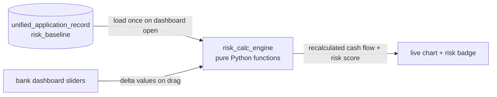
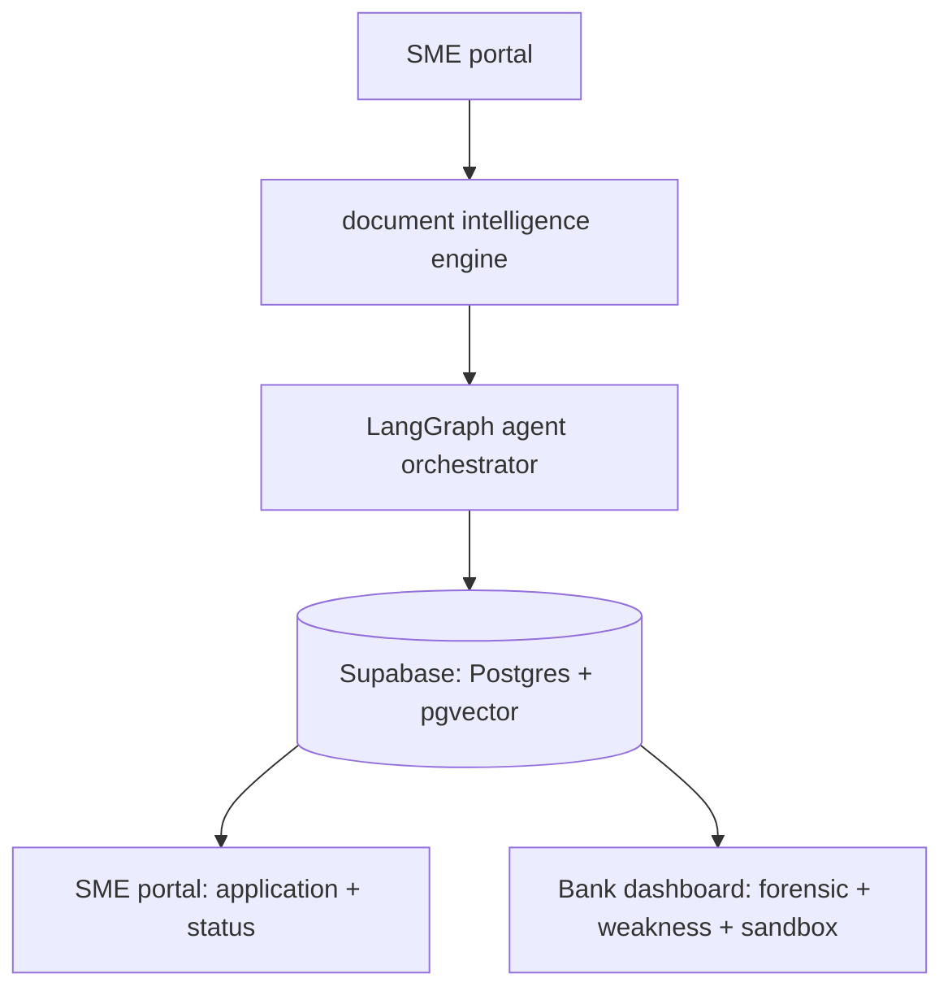

# Jadwa.ai — System Architecture (LangGraph)

This is the actual orchestration graph for the backend. Drop this file into `/docs/architecture.md` in the repo — GitHub renders Mermaid natively, no extra tooling needed.

---

## 1. Agent Orchestrator Graph

This is the `StateGraph` that runs once per submitted application — document intake through to the unified application record.


**Node-by-node:**

| Node | Input from state | Output written to state | Model |
|---|---|---|---|
| `document_intelligence_node` | raw uploaded files | `extracted_documents: list[DocumentJSON]` | GPT-4o mini (vision) |
| `forensic_accountant_node` | `extracted_documents`, `simulated_transactions` | `forensic_report: ForensicReport` | GPT-5.4 Mini |
| `devils_advocate_node` | `extracted_documents`, `sme_profile` | `weakness_report: WeaknessReport` | GPT-5.4 Mini / o4-mini |
| `saudi_market_oracle_node` | `sme_profile.sector`, `sme_profile.district` | `market_verdict: MarketVerdict` | GPT-5.4 Mini + pgvector retrieval |
| `risk_sandbox_init_node` | `extracted_documents` | `risk_baseline: RiskBaseline` (precomputed coefficients, no LLM) | none — pure Python |
| `aggregate_results_node` | all four outputs above | merged into `unified_application_record` | none — deterministic merge |
| `application_builder_node` | `unified_application_record` | final PDF + status update | WeasyPrint, no LLM |

**Why this shape matters:** the four middle nodes (`forensic`, `devil`, `oracle`, `riskinit`) have **no dependency on each other** — they all read from the same upstream state and write to different keys. In LangGraph this means you fan them out as parallel branches (`dispatch` → 4 nodes → `aggregate`), not a sequential chain. This is what makes Phase 2–4 genuinely parallelizable across your team: whoever owns the Forensic Accountant can build and test that node in total isolation from whoever owns the Saudi Market Oracle.

---

## 2. State Schema (what actually flows through the graph)

```python
class ApplicationState(TypedDict):
    application_id: str
    sme_profile: SMEProfile
    raw_documents: list[UploadedFile]

    # written by document_intelligence_node
    extracted_documents: list[DocumentJSON]

    # written by the 4 parallel agent nodes
    forensic_report: ForensicReport | None
    weakness_report: WeaknessReport | None
    market_verdict: MarketVerdict | None
    risk_baseline: RiskBaseline | None

    # written by aggregate_results_node
    unified_application_record: ApplicationRecord | None
```

Keep every agent node's output as its own typed key, never a shared blob — this is what lets `aggregate_results_node` just merge cleanly instead of needing conflict-resolution logic.

---

## 3. The Risk Sandbox Loop (deliberately NOT part of the LangGraph)

This is the one piece that must run outside the agent graph entirely. The sandbox needs sub-2-second slider response — an LLM call per slider tick would kill the demo. It only reads the `risk_baseline` that `risk_sandbox_init_node` already computed once.



`risk_calc_engine` is plain deterministic math (12-month cash flow projection with multiplier adjustments per slider) — not an agent, not a graph node. It should be a pure function: `recalculate(baseline: RiskBaseline, deltas: ScenarioDeltas) -> RiskProjection`, callable directly from a FastAPI endpoint with no LLM round-trip.

---

## 4. High-level service map (for anyone outside the engineering team)



This is the version to put in the README for non-technical reviewers (mentors, judges who ask "walk me through the architecture" before the technical deep-dive).

---

## Implementation note for whoever owns the orchestrator

LangGraph's `add_edge` for the fan-out is literally:

```python
graph.add_edge("orchestrator_dispatch", "forensic_accountant_node")
graph.add_edge("orchestrator_dispatch", "devils_advocate_node")
graph.add_edge("orchestrator_dispatch", "saudi_market_oracle_node")
graph.add_edge("orchestrator_dispatch", "risk_sandbox_init_node")

graph.add_edge("forensic_accountant_node", "aggregate_results_node")
graph.add_edge("devils_advocate_node", "aggregate_results_node")
graph.add_edge("saudi_market_oracle_node", "aggregate_results_node")
graph.add_edge("risk_sandbox_init_node", "aggregate_results_node")
```

LangGraph automatically waits for all four incoming edges before running `aggregate_results_node` — you don't need to hand-write any wait/join logic.
