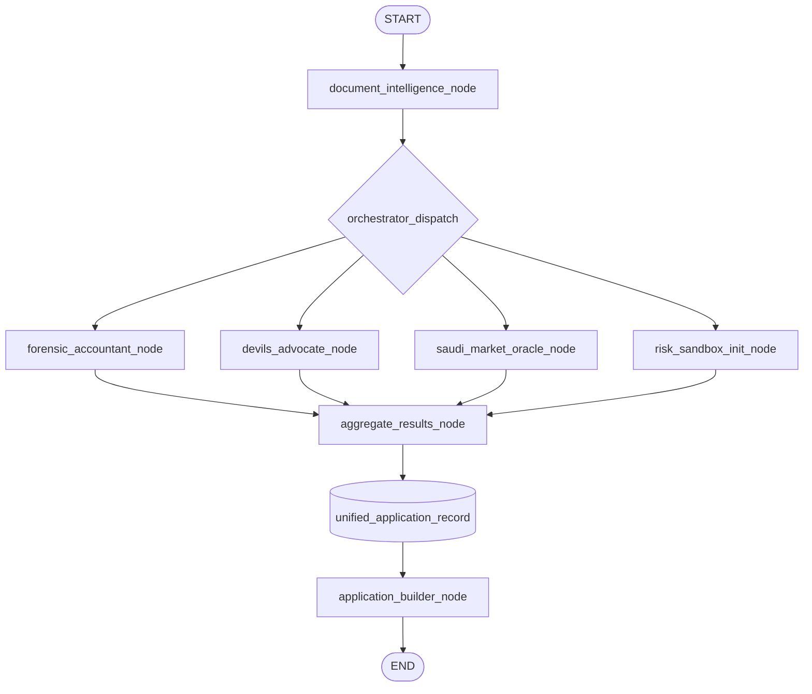
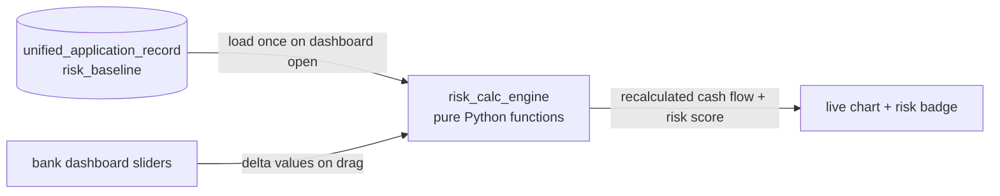
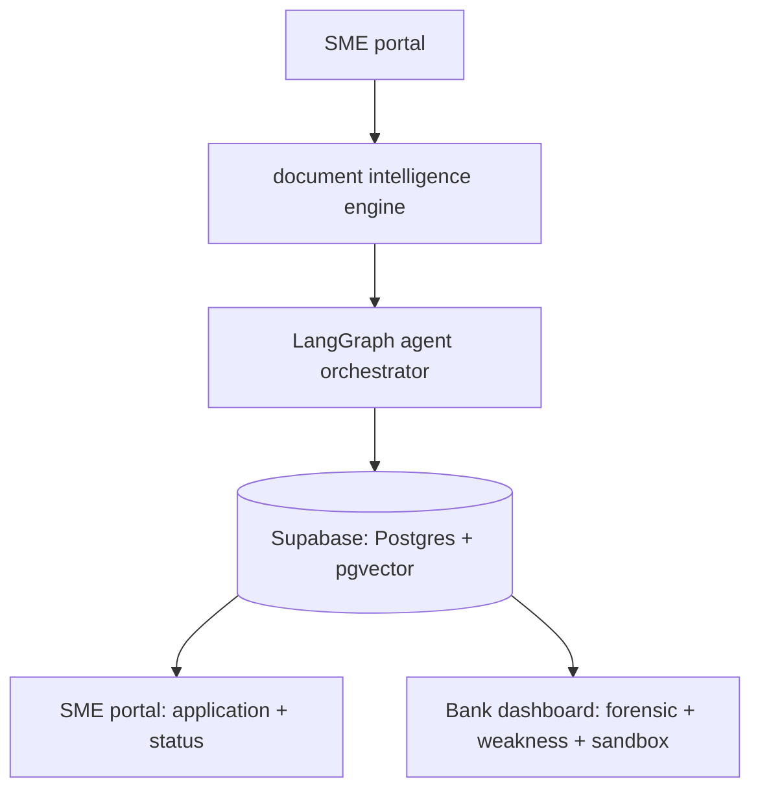

# Jadwa.ai — System Architecture (LangGraph)

This is the actual orchestration graph for the backend. Drop this file into `/docs/architecture.md` in the repo — GitHub renders Mermaid natively, no extra tooling needed.

---

## 1. Agent Orchestrator Graph

This is the `StateGraph` that runs once per submitted application — document intake through to the unified application record.



**Node-by-node:**

| Node | Input from state | Output written to state | Model |
|---|---|---|---|
| `document_intelligence_node` | raw uploaded files | `extracted_documents: list[DocumentJSON]` | **GPT-5.4** (vision) |
| `forensic_accountant_node` | `extracted_documents`, `sme_profile.cr_number`  (reads mock_open_banking_ledger from Postgres directly) | `forensic_report: ForensicReport` | **GPT-5.4 Mini** (matching in Python; LLM writes flag text) |
| `devils_advocate_node` | `extracted_documents`, `sme_profile` (also reads mock_open_banking_ledger from Postgres directly, keyed on `sme_profile.cr_number`, for both debit and credit rows) | `weakness_report: WeaknessReport` | **GPT-5.4** |
| `saudi_market_oracle_node` | `sme_profile.sector`, `sme_profile.district` | `market_verdict: MarketVerdict` | **GPT-5.4 Mini** + `text-embedding-3-large` (pgvector) |
| `risk_sandbox_init_node` | `extracted_documents` | `risk_baseline: RiskBaseline` (precomputed coefficients, no LLM) | none — pure Python |
| `aggregate_results_node` | all four outputs above | merged into `unified_application_record` | none — deterministic merge |
| `application_builder_node` | `unified_application_record` | final PDF + status update | WeasyPrint, no LLM |

> **Model choices are locked.** Rationale: at hackathon volume the cost delta between tiers is negligible (a full demo run is cents), so the real levers are latency and quality on judge-facing output. Full **GPT-5.4** goes to the two visible-quality nodes (Arabic vision extraction, Devil's Advocate insight); **GPT-5.4 Mini** carries the rest; retrieval quality comes from **`text-embedding-3-large`** (truncate to ~1024–1536 dims via the `dimensions` param to keep the pgvector index fast), not the generation model. Confirm exact model ID strings (`gpt-5.4`, `gpt-5.4-mini`) in the OpenAI dashboard before hardcoding.

**Why this shape matters:** the four middle nodes (`forensic`, `devil`, `oracle`, `riskinit`) have **no dependency on each other** — they all read from the same upstream state and write to different keys. In LangGraph this means you fan them out as parallel branches (`dispatch` → 4 nodes → `aggregate`), not a sequential chain. This is what makes Phase 2–4 genuinely parallelizable: whoever owns the Forensic Accountant can build and test that node in total isolation from whoever owns the Saudi Market Oracle.

The Forensic node does not receive the ledger through graph state. It queries mock_open_banking_ledger from Postgres in-node, filtered by the SME's CR number, and reconciles against extracted_documents. Keeping bulk reference data out of state is what keeps checkpoints small.

### 1a. Forensic node — what "ZATCA verification" actually is

Be precise about this in the docs, the UI, and the pitch, because it's an easy thing for a finance-literate judge to catch. **There is no public ZATCA endpoint that verifies an arbitrary invoice for you.** ZATCA Phase 2 (Fatoora) e-invoices embed a **Base64, TLV-encoded QR** carrying seller name, VAT registration number, timestamp, invoice total, VAT total, and the invoice hash / cryptographic-stamp fields. What the Forensic node does is **decode and structurally validate that QR offline**, then cross-check the parsed amount / date / seller against `mock_open_banking_ledger`.

So the honest phrasing everywhere is *"parses and validates the ZATCA QR (TLV)"* — **not** *"calls the ZATCA API."* Confirm the exact TLV tag order against ZATCA's current published spec when you implement.

---

## 2. State Schema (what actually flows through the graph)

```python
class ApplicationState(TypedDict):
    application_id: str
    sme_profile: SMEProfile
    raw_documents: list[UploadedFile]

    # written by document_intelligence_node
    extracted_documents: list[DocumentJSON]

    # written by the 4 parallel agent nodes
    forensic_report: ForensicReport | None
    weakness_report: WeaknessReport | None
    market_verdict: MarketVerdict | None
    risk_baseline: RiskBaseline | None

    # written by aggregate_results_node
    unified_application_record: ApplicationRecord | None
```

Keep every agent node's output as its own typed key, never a shared blob — this is what lets `aggregate_results_node` just merge cleanly instead of needing conflict-resolution logic.

---

## 3. The Risk Sandbox Loop (deliberately NOT part of the LangGraph)

This is the one piece that must run outside the agent graph entirely. The sandbox needs sub-2-second slider response — an LLM call per slider tick would kill the demo. It only reads the `risk_baseline` that `risk_sandbox_init_node` already computed once.



`risk_calc_engine` is plain deterministic math (12-month cash flow projection with multiplier adjustments per slider) — not an agent, not a graph node. It should be a pure function: `recalculate(baseline: RiskBaseline, deltas: ScenarioDeltas) -> RiskProjection`, callable directly from a FastAPI endpoint with no LLM round-trip. That function is exposed at `POST /bank/applications/{id}/sandbox/recalculate` (see §4).

---

## 4. FastAPI ↔ React API Contract

The contract both engineers build against. Lock this before Phase 2 UI/agent work so frontend and backend can move in parallel without guessing each other's shapes.

**Conventions**

- Base path: `/api/v1`.
- **Auth:** every endpoint except `/health` requires `Authorization: Bearer <supabase_jwt>`. FastAPI validates the Supabase JWT and derives `user_id` + `role` (`sme` | `bank`) from it. No custom login/signup endpoints — Supabase Auth handles those client-side.
- **Role + ownership:** `sme` routes require role `sme` **and** ownership of the application; `bank` routes require role `bank`. Any cross-role access → `403`.
- **Content type:** JSON everywhere except document upload (`multipart/form-data`).
- **Errors:** HTTP status + `{ "error": { "code": string, "message": string } }`.
- **IDs:** `application_id`, `document_id` are UUIDs.

**Status lifecycle**

```
draft ──▶ processing ──▶ review_ready ──▶ submitted ──▶ approved | rejected | info_requested
```

`draft` (created, SME uploading) → `processing` (LangGraph running) → `review_ready` (extraction done, SME correcting) → `submitted` (in bank queue) → bank decision.

### Shared

```
GET  /api/v1/me
  → 200 { user_id, role, display_name }
```

### SME portal  (role: sme)

```
POST /api/v1/applications
  → 201 { application_id, status: "draft" }

GET  /api/v1/applications
  → 200 { applications: [ { application_id, status, created_at, document_count } ] }

POST /api/v1/applications/{id}/documents        (multipart/form-data: file)
  → 201 { document_id, filename, storage_url, status: "uploaded" }
  # backend streams the file to Supabase Storage and inserts an application_documents row.
  # (Signed-URL direct-to-storage upload is the scale option; multipart-through-backend is
  #  simpler and fine for the hackathon — don't build signed URLs unless you have spare time.)

POST /api/v1/applications/{id}/process
  → 202 { status: "processing" }
  # kicks off the LangGraph run as a background task and returns immediately.

GET  /api/v1/applications/{id}/status
  → 200 { status, nodes_completed: ["document_intelligence", "forensic", ...], progress: 0.6 }
  # poll every 1–2s. See "live parse" note below.

GET  /api/v1/applications/{id}/extracted
  → 200 { documents: [ DocumentJSON, ... ] }        # feeds the review screen

PATCH /api/v1/applications/{id}/documents/{document_id}
  body { extracted_amount?, date?, vendor?, type?, ... }
  → 200 { document_id, ...updated_fields }           # SME correction

POST /api/v1/applications/{id}/submit
  → 200 { status: "submitted" }
  # locks the record, runs application_builder (PDF) if not already, enters the bank queue.

GET  /api/v1/applications/{id}/summary
  → 200 { health_summary: string, business_model_score: number, top_risks: [ ... ] }

GET  /api/v1/applications/{id}/pdf
  → 200 { pdf_url }                                   # signed Supabase Storage URL
```

### Bank dashboard  (role: bank)

```
GET  /api/v1/bank/applications?status=submitted&sort=submitted_at&order=desc
  → 200 { applications: [ {
        application_id, sme_name, sector, district, submitted_at,
        forensic_status: "green" | "yellow" | "red",
        business_model_score
    } ] }
  # the pre-scored queue.

GET  /api/v1/bank/applications/{id}
  → 200 {                                             # the ENTIRE dashboard in ONE call
        application_id, status, sme_profile, extracted_documents,
        forensic_report, weakness_report, market_verdict, risk_baseline
    }
  # this is the "fetch the whole dashboard state in a single request" from schema_mapping.md.

POST /api/v1/bank/applications/{id}/sandbox/recalculate
  body { deltas: {
        revenue_growth, cost_increase, customer_churn,
        demand_shift, interest_rate, oil_price_sensitivity
    } }
  → 200 { projection: {
        months: [ ...12 ], cash_flow: [ ...12 ],
        risk_score, risk_class: "low" | "medium" | "high",
        summary_line
    } }
  # pure Python. Loads risk_baseline server-side by application_id. No LLM. Target < 150ms.

POST /api/v1/bank/applications/{id}/decision
  body { decision: "approve" | "reject" | "request_info", note? }
  → 200 { status: "approved" | "rejected" | "info_requested" }
```

**Two design notes**

1. **Live-parse animation (the intake wow):** polling `GET /status` every 1–2s is the simplest reliable option and is what I recommend for the demo. If you later want the smoother "watch each node light up" effect, upgrade *only that endpoint* to SSE (`GET /status/stream`) — but don't build it until everything else works end-to-end.
2. **The sandbox payload stays tiny:** the client only ever sends `deltas`; the `risk_baseline` never leaves the server. That's what keeps recalculation sub-150ms and makes the sliders feel truly live.

---

## 5. Persistence & checkpointing (clearing up a naming trap)

Two different things that must not be conflated:

- **`agent_results` table** (in `schema_mapping.md`) — this is your application **results / output store**: the JSONB columns each node writes its Pydantic output to, and what the dashboard reads back. It is **not** a LangGraph checkpointer.
  → **Fix the heading in `schema_mapping.md`:** `## 2. The agent_results Table (The LangGraph Checkpointer)` → `## 2. The agent_results Table (Agent Output Store)`.
- **LangGraph checkpointer** — a *separate, optional* mechanism that persists the graph's execution state between steps so a run can resume or retry after a crash. If you want that durability, configure a Postgres checkpointer (`langgraph` `PostgresSaver`) pointed at **its own** tables; it has nothing to do with `agent_results`.

For the hackathon you can run **without** a checkpointer (in-memory) and rely on `agent_results` for the data that matters. Just don't call `agent_results` a checkpointer in any doc or the pitch.

---

## 6. High-level service map (for anyone outside the engineering team)



This is the version to put in the README for non-technical reviewers (mentors, judges who ask "walk me through the architecture" before the technical deep-dive).

---

## 7. Build sequencing & critical path (2 engineers)

**Reality:** all technical / development work is being done by **two engineers**. Split by surface to keep the fan-out parallelism real:

- **E1 — backend / agents:** LangGraph orchestrator, the six nodes, forensic matching, RAG pipeline, `risk_calc_engine`, PDF builder.
- **E2 — frontend / data:** both portals, Supabase (Auth + Storage + schema), the review screen, forensic / weakness / market UI, sandbox sliders + charts.

The original *"working end-to-end demo before July 5"* target is no longer realistic — Phase 1 foundation isn't closed and Phases 2–4 haven't started. Reset, working backward from judging on July 16–18:

| Window | E1 (backend / agents) | E2 (frontend / data) | Milestone |
|---|---|---|---|
| **Jul 1–4** (pre-enrichment) | `generate_synthetic_data.py` + ledger; lock models; stand up the empty graph skeleton | Supabase Auth (2 roles) + both portal shells + document upload; stub every endpoint in §4 | Skeleton end-to-end: upload → store → dummy status |
| **Jul 5–9** (enrichment wk1) | Document Intelligence + Forensic matching (+ ZATCA QR parse) | Review/correction screen + forensic report UI (traffic lights) | **The fraud-catch WOW works on real synthetic docs** |
| **Jul 9–12** | Devil's Advocate + Oracle (corpus → pgvector) | Weakness report UI + market verdict UI | All 4 agents produce a full `unified_application_record` |
| **Jul 12–14** | `risk_calc_engine` + Application Builder (Arabic PDF) | Sandbox sliders + live chart + risk badge | **End-to-end demo runs unassisted (~Jul 14)** |
| **Jul 14–16** | Integration, bug-fix, load the demo scenarios | Polish both portals, record backup demo video, rehearse | 3 clean run-throughs in a row |
| **Jul 16–18** (final event) | Harden + present | Harden + present | Judging — **no new features** |

**The honest risk:** two engineers across this much surface is tight. Protect the **two wow features — the forensic fraud-catch and the Risk Sandbox — above everything else**; they are what judges remember. If time slips, thin the *Oracle* (fewer sources, simpler verdict) or the *PDF polish* before you touch those two. And resist scope creep: no SSE live-stream, no signed-URL uploads, no real LangGraph checkpointer — all three are post-hackathon niceties.

---

## Implementation note for whoever owns the orchestrator

LangGraph's `add_edge` for the fan-out is literally:

```python
graph.add_edge("orchestrator_dispatch", "forensic_accountant_node")
graph.add_edge("orchestrator_dispatch", "devils_advocate_node")
graph.add_edge("orchestrator_dispatch", "saudi_market_oracle_node")
graph.add_edge("orchestrator_dispatch", "risk_sandbox_init_node")

graph.add_edge("forensic_accountant_node", "aggregate_results_node")
graph.add_edge("devils_advocate_node", "aggregate_results_node")
graph.add_edge("saudi_market_oracle_node", "aggregate_results_node")
graph.add_edge("risk_sandbox_init_node", "aggregate_results_node")
```

LangGraph automatically waits for all four incoming edges before running `aggregate_results_node` — you don't need to hand-write any wait/join logic.
